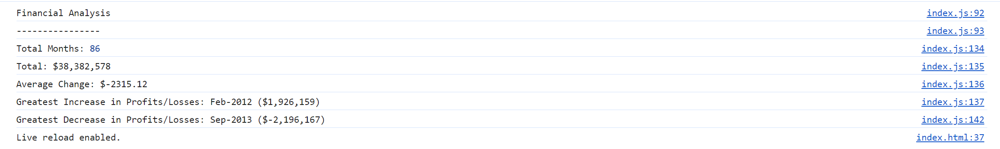

# Financial Analysis in JavaScript
## Description 

As a new developer, I thought data analysis can only be done using python. However, it is also possible to carry out financial data analysis using JavaScript as shown in this project.

Financial analysis using JavaScript required incredibly amounts of time to research how to iterate through arrays and objects in JavaScript as I was not using libraries. It was not always easy to find the same information in one place.

In this financial analysis, I have formatted and printed the title of the project. I calculated the following:
(1) number of months in the array,
(2) the total amount,
(3) average change,
(4) the greatest increase in profit and losses
(5) the greatest decrease in profit and losses.

The results had to be console-logged and, I have attached a screenshot of what is printed in the console.

The project is located at the following link:
https://mikemupararano.github.io/Console-Finances/


## Table of Contents (Optional)
N/A

## Installation

No installation is required.

## Usage 
A screenshot of the work is shown here:


```


## Credits
To complete this task, I have used for example the following:
https://www.freecodecamp.org/news/basics-of-data-analysis-with-javascript/.
The website has examples on how to find the length of an array, determine the sum and loop through the array. 

## License
Readers should refer to the MIT License in the repository.

## Badges

N/A

## Features

N/A

## Contributing

There may be limited opportunity to collaborate on this work but please feel free to contribute here as an alternative:
https://mikemupararano.github.io/school/

## Tests

N/A
---

© 2023 edX Boot Camps LLC. Confidential and Proprietary. All Rights Reserved.
